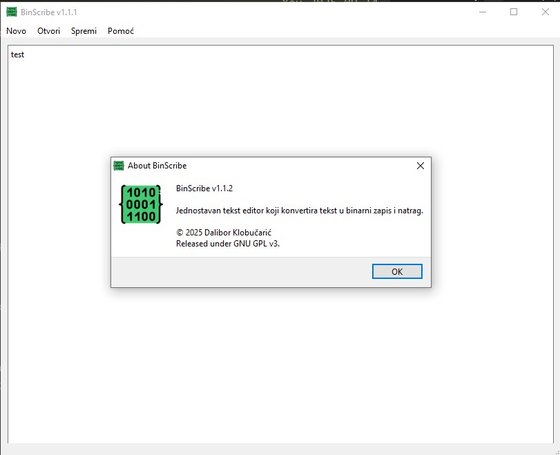

# BinScribe

**BinScribe** je lagana, cross-platformska aplikacija otvorenog koda za konverziju tekstualnih datoteka u binarni zapis (0 i 1) i obrnuto.

Aplikacija omogućuje:
- Kreiranje novih dokumenata
- Otvaranje `.txt` datoteka (automatski detektira binarni ili UTF tekst)
- Spremanje teksta u binarnom formatu
- Jednostavno i intuitivno sučelje

## Verzija

Trenutna verzija: **1.1.2**  
- Dodana binarna dekripcija  
- Pametno otvaranje `.txt` datoteka (prepoznaje binarni zapis i pretvara u čitljiv tekst)
- Dodani segment o programu

## Platforma

- Windows (.exe build)
- Linux build preko CMake (uskoro .deb paket)

## Screenshot

## Linux

### Opcija A — AppImage (jedna datoteka, preporučeno)
1. Preuzmi `BinScribe-<ver>-x86_64.AppImage`.

2. Daj dopuštenje i pokreni  
    `chmod +x BinScribe-*.AppImage` 
    `./BinScribe-*.AppImage` 
    
3. Ako javlja FUSE error 
`sudo apt update && sudo apt install -y libfuse2`

4. Ako se žali na XCB/X11 (na “mršavim” sustavima) 
`sudo apt install -y libxcb-xinerama0 libxkbcommon-x11-0 libxcb-cursor0` 
ili bez FUSE-a: 
`./BinScribe-*.AppImage --appimage-extract-and-run`

### Opcija B — Debian/Ubuntu (.deb paket)
1. Instaliraj .deb 
`sudo apt install -y libqt6core6 libqt6gui6 libqt6widgets6 qt6-base-platforms qt6-wayland libxkbcommon-x11-0 libxcb-cursor0 libxcb-xinerama0` 
`sudo dpkg -i binscribe-*.deb` 
ako prijavi nedostajuće ovisnosti 
`sudo apt -f install`

2. Pokretanje 
`BinScribe`

3. Deinstalacija 
`sudo apt remove binscribe`

4. Ako se launcher ne pojavi odmah u izborniku (opcionalno) 
`sudo update-desktop-database || true` 
`sudo gtk-update-icon-cache -f -q /usr/share/icons/hicolor || true` 

## Preuzimanje

Repozitorij: [github.com/dklobucaric/BinScribe](https://github.com/dklobucaric/BinScribe)

## Licenca

**BinScribe (izvorni kod)** je objavljen pod **MIT licencom** – vidi datoteku `LICENSE`.

BinScribe binarne distribucije uključuju **Qt** biblioteke koje su licencirane pod **LGPLv3**.
Korisnik smije zamijeniti isporučene Qt DLL-ove vlastitim buildovima Qt-a.
Tekstovi licenci nalaze se u direktoriju `licenses/` (LGPL-3.0) i/ili na stranicama Qt projekta.

- Vaš kod: MIT
- Uključene biblioteke: Qt (LGPLv3)

© 2025 Dalibor Klobučarić

## Donacije

Ako ti se sviđa aplikacija ili ti je bila korisna — podrži projekt i počasti autora pivom 🍺  
👉 [Doniraj preko PayPal-a](https://www.paypal.com/paypalme/dklobucaric)

---

**Autor:** Dalibor Klobučarić  
📍 Šenkovec, Hrvatska
